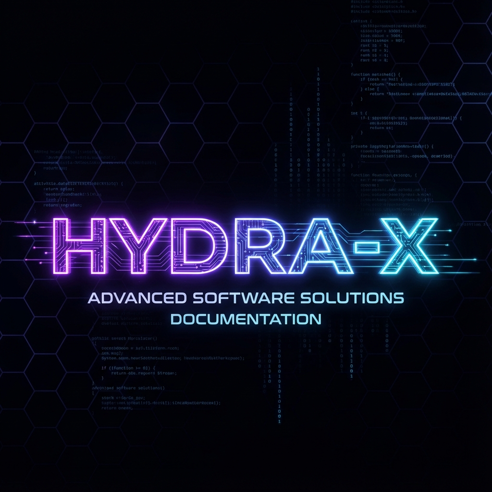
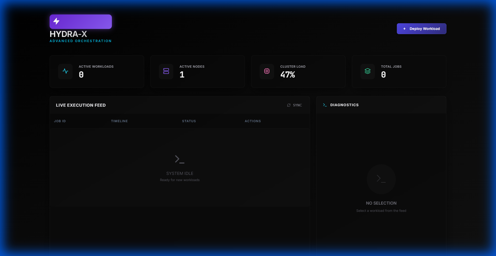
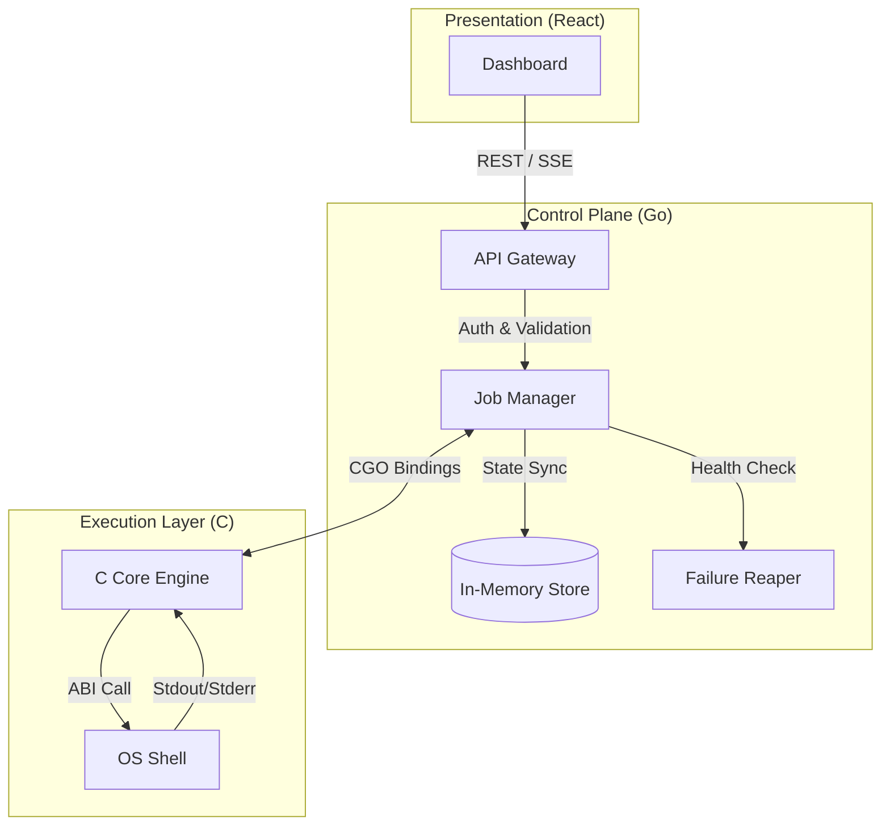

<div align="center">
  

  # HYDRA-X
  ### Advanced Distributed Orchestration Engine
  
  [](https://go.dev/)
  [](https://en.cppreference.com/)
  [](https://react.dev/)
  [](LICENSE)

  <p align="center">
    <b>Fault-Tolerant</b> • <b>High-Performance</b> • <b>Observable</b> • <b>Extensible</b>
  </p>
</div>

---

## 🚀 Overview

**HYDRA-X** is a next-generation distributed compute engine designed to bridge the gap between high-level orchestration and low-level execution. It provides a unified control plane for managing distributed workloads with millisecond-level latency, leveraging a hybrid architecture of **Go** for orchestration and **C** for raw execution power.

> *"Hydra-X is not just a tool; it's the nervous system for your distributed workloads."*

---

## 📸 Dashboard

<div align="center">
  
  <p><i>Real-time "Dark Void" Observation Deck with Live Execution Feed and Diagnostics</i></p>
</div>

---

## 🏗️ Architecture

HYDRA-X employs a **Hybrid Tripartite Architecture** to maximize both developer productivity and execution efficiency.



### Key Components

| Component | Tech Stack | Responsibility |
|-----------|------------|----------------|
| **Control Plane** | Go (Golang) | Job scheduling, state management, API gateway, and fault tolerance (Heartbeat/Reaper). |
| **Core Engine** | C / C++ | Low-level process isolation, resource sandboxing, and direct OS verification. |
| **Dashboard** | React, Framer Motion | Real-time visualization, manual intervention, and cluster observability. |

---

## 📂 Folder Structure

The project follows a "Monorepo" pattern for seamless integration.

```text
hydra-x/
├── control-plane/          # 🧠 The Brain (Go)
│   ├── cmd/server/         # Entry point
│   ├── internal/server/    # Core logic (Reaper, Registry, API)
│   └── api/v1/             # OpenAPI Specifications
├── core-engine/            # 💪 The Muscle (C)
│   ├── src/                # Implementation of the execution runtime
│   └── include/            # Shared headers & ABI definitions
├── dashboard/              # 👁️ The Eyes (React + Vite)
│   ├── src/                # Frontend source code
│   └── public/             # Static assets
├── docs/                   # 📚 Documentation & Assets
├── sdk/                    # 🐍 Python SDK for job submission
└── scripts/                # ⚙️ Build & DevOps automations
```

---

## ⚡ n8n Workflow Integration

HYDRA-X is designed to be the "Active Core" of a larger automation mesh. It integrates natively with **n8n** for event-driven workflows.

**Typical Workflow:**

1.  **Ingest**: An **n8n Webhook** receives a payload (e.g., "New User Signup").
2.  **Process**: n8n formats the data and makes a secure **POST** request to Hydra-X:
    ```json
    POST /api/v1/submit
    {
      "type": "DATA_PIPELINE",
      "command": "./process_user_data.sh --id=123"
    }
    ```
3.  **Execute**: Hydra-X runs the heavy compute task via the C-Core.
4.  **Notify**: Upon completion, Hydra-X triggers a callback webhook to n8n to send a Slack notification or update a database.

> *Note: By offloading heavy compute to Hydra-X, your n8n workflows remain lightweight and non-blocking.*

---

## 🛠️ Getting Started

### Prerequisites
*   **Go** 1.21+
*   **Node.js** 18+
*   **GCC/Clang** (for C Core compilation)
*   *Optional:* Docker

### Installation

1.  **Clone the Repository**
    ```bash
    git clone https://github.com/your-username/hydra-x.git
    cd hydra-x
    ```

2.  **One-Click Build (Windows)**
    Run the automated build script to compile the backend and install frontend dependencies.
    ```powershell
    .\build_system.bat
    ```

3.  **Manual Start**
    *   **Backend**: `cd control-plane && go run ./cmd/server/main.go`
    *   **Frontend**: `cd dashboard && npm run dev`

### Access
Open your browser to `http://localhost:5173` to access the command center.

---

## 🔒 Security

*   **Token Authentication**: All API endpoints are protected via `Authorization: Bearer` tokens.
*   **Isolation**: The C-Core provides logical separation for executing processes, preventing runtime crashes from affecting the control plane.

---

<div align="center">
  <sub>Built with ❤️ by Tushar</sub>
</div>
